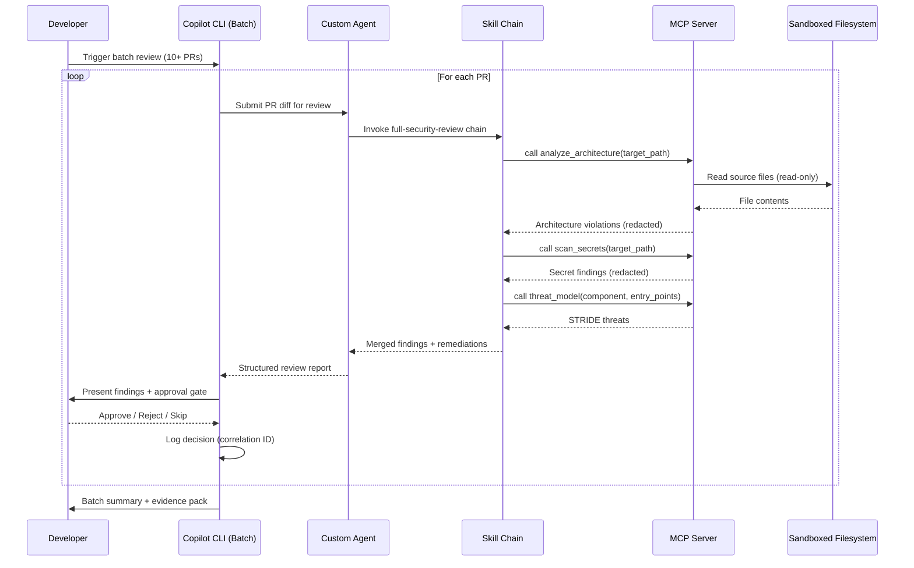
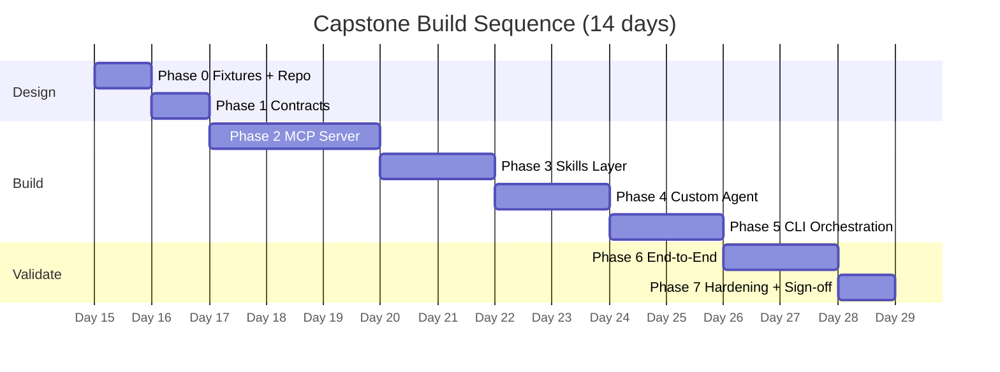

# Capstone Project

## Objective
Build a production-grade **multi-repo governance system** that demonstrates end-to-end mastery of all 4 advanced modules.

## Scenario
Your organization needs an automated code-quality enforcement system that reviews every PR for architectural conformance, secret exposure, and injection vulnerabilities—without relying on any CI/CD pipeline.

### System Architecture



### Component Responsibilities

| Component | Role | Boundary |
|-----------|------|----------|
| **Copilot CLI** | Orchestrator — iterates PRs, captures human decisions | No direct code analysis |
| **Custom Agent** | Decision layer — interprets findings, applies judgment | Read-only, deny-by-default tools |
| **Skill Chain** | Detection pipeline — detect → analyze → remediate | Stateless, composable, versioned |
| **MCP Server** | Execution engine — runs analysis inside sandbox | Read-only FS, no network, timeout-bound |

## Requirements

### 1. Custom Agent (Week 2 Application)
- **Persona**: "Principal Security Architect" with defense-in-depth mindset
- **Constraints**: Deny-by-default, explicit approval for external API calls
- **Autonomy**: Multi-step planning with explicit checkpoints
- **Evidence**: `.agent.md` with persona definition, tool restrictions, RBAC mapping

### 2. MCP Server (Week 4 Application)
- **Tools**:
  - `analyze_architecture` - Detect layering violations
  - `scan_secrets` - Find credential exposure
  - `threat_model` - Generate STRIDE analysis
- **Sandboxing**: Read-only filesystem access, network isolation
- **Observability**: Correlation IDs, redacted logs, timeout enforcement
- **Evidence**: MCP server implementation, error contracts, test suite

### 3. Skills (Week 3 Application)
- **Skill 1**: `enforce-clean-architecture` - Check dependency rules
- **Skill 2**: `review-for-injection` - Detect SQLi, XSS, command injection
- **Skill 3**: `suggest-safer-alternative` - Propose mitigations
- **Composition**: Chain skills in review workflow
- **Evidence**: Skill definitions, dependency graph, versioning strategy

### 4. Copilot CLI Automation (Week 1 Application)
- **Batch review**: Process all open PRs in repo
- **Natural-language Git**: Create review-comment branches
- **Prompt-in-the-loop**: Human approval gates for remediation
- **Evidence**: CLI scripts, prompt templates, execution logs

## Acceptance Criteria (Binary)

| # | Criterion | Verified By |
|---|-----------|-------------|
| 1 | Custom agent restricts tool access per RBAC | Agent config + test transcript |
| 2 | MCP server sandbox prevents filesystem writes | Security test suite |
| 3 | Skills compose without circular dependencies | Dependency graph validation |
| 4 | CLI automation handles 10+ PRs with <5% false positives | Batch execution log + auditor review |
| 5 | All tools emit correlation IDs for audit trail | Log analysis script |
| 6 | Redaction prevents secret leakage in logs | Secret injection test |
| 7 | Architecture violations detected with zero false negatives | Known-bad code test cases |
| 8 | PR review completes in <2min per 500 LOC | Performance benchmark |

## Deliverables

1. **Repo Structure**:
   ```
   capstone-project/
   ├── .agent.md                 # Custom agent persona + tool policy
   ├── contracts/
   │   ├── tool-schemas/         # JSON Schema per MCP tool
   │   ├── error-contract.json   # Canonical error envelope
   │   └── log-schema.json       # Structured log format
   ├── mcp-server/
   │   ├── server.py             # MCP entry point
   │   ├── tools/
   │   │   ├── analyze_architecture.py
   │   │   ├── scan_secrets.py
   │   │   └── threat_model.py
   │   ├── sandbox.py            # Read-only FS + path validation
   │   ├── redaction.py          # Response redaction filter
   │   ├── correlation.py        # Correlation ID generator
   │   └── tests/
   │       ├── test_tools.py
   │       ├── test_sandbox.py
   │       └── test_redaction.py
   ├── skills/
   │   ├── enforce-clean-architecture/
   │   │   ├── SKILL.md
   │   │   └── CHANGELOG.md
   │   ├── review-for-injection/
   │   │   ├── SKILL.md
   │   │   └── CHANGELOG.md
   │   ├── suggest-safer-alternative/
   │   │   ├── SKILL.md
   │   │   └── CHANGELOG.md
   │   └── full-security-review/
   │       └── SKILL.md          # Composite chain
   ├── cli-scripts/
   │   ├── batch-review.sh       # Main orchestrator
   │   └── prompts/              # Reusable prompt templates
   ├── fixtures/
   │   ├── known-bad/            # Seeded violations (see catalog)
   │   └── known-good/           # Clean code for FP control
   ├── scripts/
   │   ├── validate_skill_graph.py
   │   └── verify_acceptance.sh  # Runs all 8 AC checks
   ├── docs/
   │   ├── architecture.mmd      # Mermaid system diagram
   │   ├── threat-model.md       # STRIDE per component
   │   ├── audit-policy.md       # Retention + redaction rules
   │   └── rollout-playbook.md   # Team adoption guide
   └── evidence/
       ├── agent-logs/           # Redacted transcripts
       ├── performance-results/  # Benchmark data
       ├── validation-matrix.md  # AC ↔ evidence mapping
       └── sign-off.md          # Architect + reviewer signatures
   ```

2. **Documentation**:
   - Architecture diagram (Mermaid) showing component interactions
   - Threat model with STRIDE analysis
   - Audit policy with retention and redaction rules
   - Rollout playbook for team adoption

3. **Evidence**:
   - 10+ PR reviews processed with logs
   - Performance benchmark results
   - Security test results (sandbox escape attempts, secret injection)
   - Validation report confirming all 8 acceptance criteria

## Rubric

| Category | Exemplary (4) | Proficient (3) | Developing (2) | Insufficient (1) | Evidence Required |
|----------|---------------|----------------|----------------|------------------|-------------------|
| **Security** | All tools sandboxed, secrets redacted, RBAC enforced, adversarial tests pass | Minor security gaps, fixable within 1 day | Security controls incomplete or untested | No security controls | `test_sandbox.py` results, `test_redaction.py` results, adversarial transcript |
| **Architecture** | Clean separation, DDD boundaries, patterns enforced, no coupling violations | Minor coupling, mostly clean, documented exceptions | Significant coupling issues | Monolithic design | DAG validator output, architecture diagram, skill composition log |
| **Observability** | Correlation IDs on every call, structured JSON logs, redaction verified | Logs present, minimal structure, IDs on most calls | Sparse logging, missing IDs | No observability | Sample log extract, correlation-grep script output |
| **Performance** | <2 min/500 LOC, streams partial results, backoff tested | Meets time target, no streaming | Slow but completes | Does not complete | `evidence/performance-results/` benchmark output |
| **Auditability** | Full evidence trail, reproducible from clean clone, validation matrix complete | Most evidence captured, minor gaps | Gaps in 2+ acceptance criteria | No audit trail | `validation-matrix.md`, `sign-off.md` |

## Timeline
- **Week 4 End**: Design phase — architecture diagram, threat model, contract schemas (Phase 0-1)
- **Week 5**: Implementation — MCP server, skills, agent definition (Phase 2-4)
- **Week 6**: Integration — CLI orchestration, end-to-end validation (Phase 5-6)
- **Week 7**: Hardening — fault injection, performance benchmarks, evidence pack, final sign-off (Phase 7)

---

## Known-Bad Fixture Catalog

Seed `fixtures/known-bad/` with these specific violations so acceptance criteria are testable against known ground truth.

| # | File | Violation Type | Module Tested | Expected Detection |
|---|------|---------------|---------------|--------------------|
| 1 | `api/handler.py` | Command injection (`subprocess.run(cmd, shell=True)`) | Skills: review-for-injection | CRITICAL |
| 2 | `api/search.py` | SQL injection (f-string in query) | Skills: review-for-injection | CRITICAL |
| 3 | `api/render.py` | XSS (unescaped user input in HTML template) | Skills: review-for-injection | HIGH |
| 4 | `auth/login.py` | Weak hashing (MD5 for passwords) | MCP: scan_secrets | HIGH |
| 5 | `auth/login.py` | Hardcoded secret key | MCP: scan_secrets | CRITICAL |
| 6 | `db/connection.py` | Hardcoded DB password | MCP: scan_secrets | CRITICAL |
| 7 | `db/connection.py` | SSL disabled on DB connection | MCP: threat_model | MEDIUM |
| 8 | `presentation/api.py` | Imports infrastructure directly (layer violation) | MCP: analyze_architecture | ERROR |
| 9 | `domain/entities.py` | Imports infrastructure (domain depends on infra) | MCP: analyze_architecture | ERROR |
| 10 | `api/admin.py` | Missing input validation on admin endpoint | Skills: review-for-injection | HIGH |
| 11 | `auth/session.py` | JWT without expiry check | MCP: threat_model | MEDIUM |
| 12 | `config/settings.py` | API key in config file (not env var) | MCP: scan_secrets | CRITICAL |

**Usage:** Acceptance Criterion 7 requires all 12 issues detected (zero false negatives).

---

## Validation Matrix Template

Copy to `evidence/validation-matrix.md` and fill during Phase 6.

| AC# | Criterion | Phase Verified | Evidence Artifact | Result | Notes |
|-----|-----------|---------------|-------------------|--------|-------|
| 1 | Agent restricts tool access per RBAC | 4 | `evidence/agent-logs/rbac-test-transcript.log` | PASS / FAIL | |
| 2 | MCP sandbox prevents filesystem writes | 2 | `mcp-server/tests/test_sandbox.py` output | PASS / FAIL | |
| 3 | Skills compose without circular deps | 3 | `scripts/validate_skill_graph.py` output | PASS / FAIL | |
| 4 | CLI handles 10+ PRs, <5% FP rate | 5 | `evidence/agent-logs/batch-run-*.log` | PASS / FAIL | FP count: ___ / ___ |
| 5 | All tools emit correlation IDs | 2,5 | `grep -r 'mcp-' evidence/agent-logs/` | PASS / FAIL | |
| 6 | Redaction prevents secret leakage | 2 | `mcp-server/tests/test_redaction.py` output | PASS / FAIL | |
| 7 | Zero false negatives on known-bad | 6 | `evidence/validation-matrix.md` fixture results | PASS / FAIL | Detected: ___ / 12 |
| 8 | <2 min per 500 LOC | 6 | `evidence/performance-results/benchmark.json` | PASS / FAIL | Actual: ___s |

**Sign-off:**
- Architect: _________________________ Date: _________
- Reviewer: _________________________ Date: _________

---

## Troubleshooting Guide

Common integration issues encountered during capstone build, with resolution paths.

| Symptom | Likely Root Cause | Resolution |
|---------|-------------------|------------|
| Agent invokes MCP tool but gets empty response | MCP server not registered in `.vscode/settings.json` | Verify `github.copilot.advanced.mcp.servers` config matches server path |
| Skill chain stops at step 2 | Intermediate output schema mismatch between skills | Compare output schema of step 1 against input schema of step 2 |
| Batch CLI script re-processes already-reviewed PRs | Checkpoint file not written or wrong path | Verify `.checkpoint` file exists and index increments |
| MCP tool returns `PERMISSION_DENIED` on valid path | Sandbox `workspace_root` doesn't match actual workspace | Print `workspace_root.resolve()` and compare with target path |
| Correlation IDs missing from some log entries | `contextvars.ContextVar` not propagated into async subtasks | Use `copy_context().run()` or pass correlation ID explicitly |
| Agent bypasses checkpoint gate | Multi-step plan missing explicit "STOP" instruction at gate | Add `## GATE: STOP AND WAIT FOR HUMAN APPROVAL` in agent plan |
| Redaction misses a secret pattern | Pattern not in redaction regex list | Add failing pattern to `ResponseRedactor.SECRET_PATTERNS` and re-test |
| DAG validator reports false cycle | Skill references itself in `dependencies` | Remove self-reference; only list external dependencies |
| Streaming tool returns no progress | Generator not yielded correctly | Ensure `async for chunk in ...` not `await` on generator |
| Performance benchmark exceeds 2 min | Tool scans entire repo including `.git/`, `node_modules/` | Add exclusion patterns to `find` or `rglob` filter |

## Implementation Playbook (Step-by-Step)

Use this sequence as the default build order. Do not parallelize until the current gate passes.

### Phase Order and Dependencies

| Phase | Build Focus | Depends On | Primary Output | Gate |
|------|-------------|------------|----------------|------|
| 0 | Baseline + Fixtures | None | Test corpus, known-bad code, repo skeleton | G0 |
| 1 | Contracts First | 0 | Tool schemas, error contracts, log schema | G1 |
| 2 | MCP Server Core | 1 | 3 tools + sandbox + timeout + redaction | G2 |
| 3 | Skills Layer | 1,2 | 3 skills + composition + DAG validation | G3 |
| 4 | Custom Agent | 2,3 | Persona, RBAC, deny-by-default, checkpoints | G4 |
| 5 | CLI Orchestrator | 2,3,4 | Batch review workflow + approval gates | G5 |
| 6 | End-to-End Validation | 2,3,4,5 | Full PR-review runbook + evidence pack | G6 |
| 7 | Hardening + Final Sign-off | 6 | Performance report + audit package | G7 |

### Phase 0: Baseline and Fixtures
1. Create the capstone repo structure exactly as defined in Deliverables.
2. Add two test corpora:
   - `fixtures/known-bad/`: seeded violations (architecture, injection, secrets).
   - `fixtures/known-good/`: clean implementations for false-positive control.
3. Define target throughput: at least 10 PRs in batch simulation.

**Checkpoint G0 (binary):**
- [ ] Repo tree matches required structure.
- [ ] Known-bad corpus has at least 12 intentional issues.
- [ ] Known-good corpus has zero intentional issues.

### Phase 1: Contract-First Design
1. Define JSON schema for each MCP tool request/response.
2. Define standard error contract: `INVALID_INPUT`, `PERMISSION_DENIED`, `TIMEOUT`, `INTERNAL_ERROR`, plus `retryable` flag.
3. Define log contract with required fields: timestamp, correlation_id, tool, severity, redaction_status.
4. Freeze interfaces before coding implementation logic.

**Checkpoint G1 (binary):**
- [ ] Schemas validate with sample payloads.
- [ ] All tools and skills map to one canonical error contract.
- [ ] Interface review approved by architect (recorded in evidence).

### Phase 2: MCP Server Core
1. Implement `analyze_architecture`, `scan_secrets`, `threat_model` behind schema validation.
2. Enforce sandbox controls: read-only FS, blocked network egress, path traversal prevention.
3. Add timeout and retry policy.
4. Add response redaction and correlation-id logging.

**Checkpoint G2 (binary):**
- [ ] All 3 tools callable and schema-valid.
- [ ] Sandbox escape tests fail safely.
- [ ] Timeout test passes with deterministic error output.
- [ ] Redaction test proves no secret leakage.

### Phase 3: Skills Layer
1. Implement `enforce-clean-architecture`, `review-for-injection`, `suggest-safer-alternative`.
2. Compose skills into one review chain with explicit data handoff.
3. Add DAG validation script for dependency-cycle detection.
4. Apply semantic versioning and changelogs.

**Checkpoint G3 (binary):**
- [ ] Skill chain executes in required order.
- [ ] DAG validator reports zero cycles.
- [ ] Breaking-change simulation documented with migration note.

### Phase 4: Custom Agent
1. Define persona and scope in `.agent.md`.
2. Enforce deny-by-default tool policy.
3. Add multi-step plan with approval checkpoints.
4. Add adversarial prompt-injection tests.

**Checkpoint G4 (binary):**
- [ ] Agent rejects out-of-scope and denied operations.
- [ ] Checkpoint gates cannot be bypassed.
- [ ] Adversarial test suite passes.

### Phase 5: CLI Orchestration
1. Implement batch workflow script to process at least 10 PRs.
2. Add human approval steps for remediation commits.
3. Add checkpoint/resume semantics for interrupted runs.
4. Capture structured execution logs linked by correlation ID.

**Checkpoint G5 (binary):**
- [ ] Batch run completes on at least 10 PRs.
- [ ] False-positive rate is under 5%.
- [ ] Resume after interruption works without reprocessing completed PRs.

### Phase 6: End-to-End Validation
1. Run full flow against known-bad corpus.
2. Run full flow against known-good corpus.
3. Produce validation matrix mapping each acceptance criterion to evidence artifact.

**Checkpoint G6 (binary):**
- [ ] Zero false negatives on known-bad architecture violations.
- [ ] No secret leakage in logs.
- [ ] End-to-end runtime under 2 minutes per 500 LOC.

### Phase 7: Hardening and Final Sign-off
1. Execute fault injection: malformed inputs, tool timeout, partial failures.
2. Run replay test for determinism on same inputs.
3. Assemble final evidence package and sign-off report.

**Checkpoint G7 (binary):**
- [ ] All 8 capstone acceptance criteria marked Pass.
- [ ] Rubric score is at least 3 in all categories.
- [ ] Validation report signed by architect and reviewer.

### Execution Cadence (Suggested)



| Days | Phases | Key Outcome |
|------|--------|-------------|
| 1-2 | 0-1 | Repo skeleton, fixtures, frozen contracts |
| 3-5 | 2 | MCP server with 3 tools, sandbox, redaction |
| 6-7 | 3 | 3 skills + composite chain, DAG validated |
| 8-9 | 4 | Agent definition, RBAC tested, adversarial tests |
| 10-11 | 5 | Batch CLI processing 10+ PRs with approval gates |
| 12-13 | 6 | End-to-end run on fixtures, validation matrix filled |
| 14 | 7 | Fault injection, performance benchmark, sign-off |

## Success Threshold
Minimum **3 (Proficient)** in all rubric categories. Any **1 (Insufficient)** requires redo.
