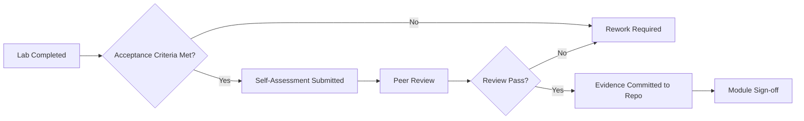

# Advanced GitHub Copilot Curriculum — Architect Track

---

## 0. Executive Summary (≤ 200 words)

This 4-week curriculum transforms a Principal Software Architect into a **production-grade Copilot power user** across four advanced domains: CLI automation, custom agents, skills authoring, and MCP server development.

**Measurable outcomes upon completion:**
1. Automate multi-repo batch refactors and natural-language Git workflows via Copilot CLI — processing 10+ repos with <5% manual intervention.
2. Author custom agents with persona constraints, RBAC-scoped tool access, and denial-by-default autonomy bounds — passing adversarial prompt-injection tests.
3. Build reusable, parameterized, chainable skills with dependency graphs and semantic versioning — composable across teams with zero circular dependencies.
4. Implement a sandboxed MCP server exposing custom tools with streaming responses, correlation IDs, redaction policies, and enforced timeout contracts — surviving fault-injection tests.

**Cross-cutting guarantees across all modules:**
- Every artifact is repo-committed with audit evidence (logs, configs, transcripts).
- Security controls: prompt-injection defense, sandboxed execution, schema-validated outputs, deterministic approval gates.
- Docs-as-code with Mermaid diagrams for all architecture decisions.
- No CI/CD dependency — all automation is local via Copilot CLI.

**Evaluation:** Binary acceptance criteria per lab. Rubric-scored capstone. Outcomes > activity.

---

## 1. Curriculum Roadmap (4 Weeks)

### Week 1: Copilot + CLI for Automation
**Theme:** Natural-language tasking, Git workflows, batch refactors  
**Module:** [modules/week1-copilot-cli/](../modules/week1-copilot-cli/)

| Lab | Focus | Deliverable | Acceptance Criteria |
|-----|-------|-------------|---------------------|
| [Lab 1](../labs/week1/lab1-cli-automation/) | Local automation scripting | CLI-driven Python refactor across 3 modules | All 3 modules refactored, tests pass, diff committed |
| [Lab 2](../labs/week1/lab2-git-natural-language/) | Natural-language Git commands | Branch, commit, PR via Copilot CLI | PR created with correct branch, message, and linked issue |
| [Lab 3](../labs/week1/lab3-batch-refactor/) | Batch prompt-in-the-loop workflow | Multi-file rename + type annotation batch | 100% of target files processed, human approval log captured |

**Review Checklist:**
- [ ] CLI commands execute without manual intervention after initial prompt
- [ ] All Git operations are auditable (commit messages reference intent)
- [ ] Batch operations include rollback strategy (Git-based)
- [ ] No secrets or PII in CLI transcripts
- [ ] Prompt templates stored as repo artifacts

**Pitfalls & Anti-patterns:**
- ❌ Running CLI automation without `--dry-run` first
- ❌ Storing API tokens in prompt templates
- ❌ Batch processing without checkpoint/resume capability
- ❌ Over-relying on single-shot prompts for complex multi-step operations

**Reading List:**
- [GitHub Copilot CLI Documentation](https://docs.github.com/en/copilot/github-copilot-in-the-cli)
- [Copilot Chat in CLI: Advanced Usage](https://docs.github.com/en/copilot/github-copilot-in-the-cli/using-github-copilot-in-the-cli)

---

### Week 2: Custom Agents
**Theme:** Persona definition, autonomy bounds, multi-step planning  
**Module:** [modules/week2-custom-agents/](../modules/week2-custom-agents/)

| Lab | Focus | Deliverable | Acceptance Criteria |
|-----|-------|-------------|---------------------|
| [Lab 1](../labs/week2/lab1-custom-agent-basic/) | Agent persona & constraints | `.agent.md` with security-auditor persona | Agent responds only within defined scope; rejects out-of-scope requests |
| [Lab 2](../labs/week2/lab2-agent-constraints/) | RBAC & denial-by-default | Agent with tool restrictions | Agent denied access to filesystem write tools; audit log proves it |
| [Lab 3](../labs/week2/lab3-multi-step-planning/) | Multi-step planning with checkpoints | Agent executes 5-step review workflow | Each step has explicit approval gate; no step skipped |

**Review Checklist:**
- [ ] Agent persona definition is unambiguous (no conflicting instructions)
- [ ] Tool access follows least-privilege principle
- [ ] Denial-by-default is verifiable (adversarial test included)
- [ ] Multi-step plans emit structured checkpoints
- [ ] Agent cannot escalate its own permissions

**Pitfalls & Anti-patterns:**
- ❌ Overly broad persona definitions ("you are a helpful assistant")
- ❌ Granting all tools then trying to restrict specific ones
- ❌ Missing escalation paths when agent encounters ambiguity
- ❌ No correlation between agent actions and audit IDs

**Reading List:**
- [VS Code Custom Agents (agent mode)](https://code.visualstudio.com/docs/copilot/chat/chat-agent-mode)
- [`.github/copilot-instructions.md` Reference](https://docs.github.com/en/copilot/customizing-copilot/adding-repository-custom-instructions-for-github-copilot)

---

### Week 3: Skills
**Theme:** Reusable behaviors, dependency graphs, composition  
**Module:** [modules/week3-skills/](../modules/week3-skills/)

| Lab | Focus | Deliverable | Acceptance Criteria |
|-----|-------|-------------|---------------------|
| [Lab 1](../labs/week3/lab1-skill-authoring/) | Author a parameterized skill | `SKILL.md` for architecture enforcement | Skill invoked by agent, correct parameters passed, result validated |
| [Lab 2](../labs/week3/lab2-skill-composition/) | Compose skills into a workflow | 3-skill chain: detect → analyze → remediate | Chain executes in order; intermediate outputs feed next skill |
| [Lab 3](../labs/week3/lab3-skill-versioning/) | Dependency graph & versioning | Versioned skill set with semver | Breaking change detected; backward compatibility verified |

**Review Checklist:**
- [ ] Skills are stateless and idempotent
- [ ] Parameters are typed and validated at invocation
- [ ] Dependency graph has no cycles (verified by script)
- [ ] Version bumps follow semantic versioning rules
- [ ] Skills degrade gracefully when dependencies are unavailable

**Pitfalls & Anti-patterns:**
- ❌ Monolithic skills that do too much (violate single responsibility)
- ❌ Implicit dependencies between skills (no declared graph)
- ❌ Hardcoded paths or environment assumptions in skill definitions
- ❌ Skipping version bumps after behavioral changes

**Reading List:**
- [Copilot Custom Skills (SKILL.md)](https://code.visualstudio.com/docs/copilot/chat/chat-agent-mode)
- [Reusable Prompt Patterns](https://docs.github.com/en/copilot/customizing-copilot)

---

### Week 4: MCP Server
**Theme:** Custom tools/APIs, sandboxing, streaming, error contracts  
**Module:** [modules/week4-mcp-server/](../modules/week4-mcp-server/)

| Lab | Focus | Deliverable | Acceptance Criteria |
|-----|-------|-------------|---------------------|
| [Lab 1](../labs/week4/lab1-mcp-tools/) | Author MCP tools | Python MCP server with 3 custom tools | Tools callable from Copilot; correct JSON schema; results validated |
| [Lab 2](../labs/week4/lab2-mcp-sandboxing/) | Sandboxing & security | Sandbox enforcement + redaction policy | Filesystem write blocked; secrets redacted from responses |
| [Lab 3](../labs/week4/lab3-mcp-streaming/) | Streaming & error contracts | Streaming tool responses + timeout handling | Timeout enforced at 30s; partial results returned; correlation IDs logged |

**Review Checklist:**
- [ ] MCP server exposes tool discovery metadata (JSON Schema)
- [ ] All tools have explicit error contracts (error types, retry guidance)
- [ ] Sandbox prevents privilege escalation
- [ ] Redaction policy covers secrets, PII, internal hostnames
- [ ] Streaming responses handle client disconnection gracefully

**Pitfalls & Anti-patterns:**
- ❌ Tools with unbounded execution time (no timeout enforcement)
- ❌ Returning raw exception details to the client
- ❌ Missing input validation on tool parameters
- ❌ Logging sensitive data before redaction filter is applied

**Reading List:**
- [Model Context Protocol Specification](https://modelcontextprotocol.io/)
- [Building MCP Servers (Python SDK)](https://modelcontextprotocol.io/docs/concepts/servers)
- [MCP Security Best Practices](https://modelcontextprotocol.io/docs/concepts/transports)

---

## 2. Cross-Cutting Concerns

### Safety Layers
1. **Prompt-injection defense**: All agent/skill inputs pass through sanitization hooks. Test with known injection payloads.
2. **Sandboxed execution**: MCP tools run in restricted subprocess (`seccomp`/`AppArmor` profiles on Linux). No network egress by default.
3. **Schema-validated outputs**: Every tool response validated against JSON Schema before passing to agent. Malformed responses trigger circuit breaker.
4. **Deterministic approval gates**: Multi-step agent plans require explicit human approval at defined checkpoints. No auto-approve for destructive operations.

### Data Governance
1. **Secret hygiene**: Pre-commit hooks scan for secrets in prompt transcripts and agent logs. Use `detect-secrets` baseline.
2. **PII handling**: Redaction filter applied before any output is logged. Classification labels (`INTERNAL`, `RESTRICTED`, `PUBLIC`) on all artifacts.
3. **Context minimization**: Agents receive only the minimum context needed per step. No full-repo context dumps.
4. **Provenance tagging**: Every AI-generated artifact tagged with `ai-generated: true` metadata and Copilot session hash.

### SDLC (Without CI/CD)
1. **PR templates**: Include "AI-Assisted Changes" section with:
   - Model used, prompt hash, timestamp
   - Human review confirmation checkbox
   - Architecture conformance attestation
2. **Reviewer heuristics**: Flag PRs where >60% of diff is AI-generated for mandatory architecture review.
3. **AI-changed-code labels**: Automated label `copilot-assisted` applied via Copilot CLI on commit.
4. **Local automation**: All quality gates run locally via Copilot CLI + MCP tools. No external CI dependency.

### Risk Register Template

| Risk ID | Description | Module | Likelihood | Impact | Mitigation | Owner | Status |
|---------|-------------|--------|-----------|--------|------------|-------|--------|
| R-001 | Agent escalates permissions beyond RBAC | Custom Agents | Medium | High | Denial-by-default + adversarial tests | Architect | Open |
| R-002 | MCP tool timeout causes cascading failure | MCP Server | Low | High | Circuit breaker + partial result return | Architect | Open |
| R-003 | Skill composition creates circular dependency | Skills | Medium | Medium | DAG validation script pre-commit | Architect | Open |
| R-004 | CLI batch operation corrupts repo state | Copilot CLI | Low | Critical | Dry-run + checkpoint/resume + Git reflog | Architect | Open |
| R-005 | Prompt injection bypasses agent constraints | All | High | Critical | Input sanitization + adversarial test suite | Architect | Open |

### Sign-off Workflow

---

## 3. Module Quick Reference

| Week | Module | Deep-Dive | Lab Folder | Checklist | Key Artifact |
|------|--------|-----------|------------|-----------|--------------|
| 1 | Copilot + CLI | [README](../modules/week1-copilot-cli/README.md) | [labs/week1/](../labs/week1/) | [CHECKLIST](../modules/week1-copilot-cli/CHECKLIST.md) | CLI scripts + prompt templates |
| 2 | Custom Agents | [README](../modules/week2-custom-agents/README.md) | [labs/week2/](../labs/week2/) | [CHECKLIST](../modules/week2-custom-agents/CHECKLIST.md) | `.agent.md` + RBAC config |
| 3 | Skills | [README](../modules/week3-skills/README.md) | [labs/week3/](../labs/week3/) | [CHECKLIST](../modules/week3-skills/CHECKLIST.md) | `SKILL.md` + dependency graph |
| 4 | MCP Server | [README](../modules/week4-mcp-server/README.md) | [labs/week4/](../labs/week4/) | [CHECKLIST](../modules/week4-mcp-server/CHECKLIST.md) | MCP server + tool schemas |
| 4+ | Capstone | [README](../capstone/README.md) | — | — | Full governance system |

---

## 4. Scope Coverage

The original curriculum instructions define 13 advanced modules. This curriculum covers **4 of 13 as dedicated modules**. The remaining 9 are **not covered** — some are touched incidentally as scenario context but are not taught as standalone topics.

### Covered (Dedicated Module + Labs)

| # | Scope Module | Week | Labs | Status |
|---|-------------|------|------|--------|
| 2 | **Copilot + CLI for Automation** | Week 1 | 3 labs | ✅ Fully covered |
| 7 | **Custom Agents** | Week 2 | 3 labs | ✅ Fully covered |
| 10 | **Skills** | Week 3 | 3 labs | ✅ Fully covered |
| 11 | **MCP Server** | Week 4 | 3 labs | ✅ Fully covered |

### Not Covered

| # | Scope Module | Notes |
|---|-------------|-------|
| 1 | Prompt Engineering (Advanced) | Prompt templates appear in Week 1 as a _technique_ within CLI automation, but no dedicated instruction on advanced prompt engineering (instruction chaining, role prompting, boundary conditions, schema outputs) |
| 3 | Architecture-Conforming Code Gen | Clean architecture is used as the _sample domain_ for skills and MCP tools, but there is no module on using Copilot to enforce architecture, DDD boundaries, or style coherence |
| 4 | Copilot for Test Engineering | Adversarial tests and security test suites exist as _validation exercises_ within other labs, but no module on Copilot-driven unit/property-based/mutation testing |
| 5 | Copilot for Code Reviews | Week 2 Lab 3 performs a multi-step security review, but the focus is agent planning, not Copilot-assisted code review (multi-file reasoning, architectural critique, refactoring plans) |
| 6 | Security Engineering with Copilot | Security is the _scenario theme_ (STRIDE, injection detection, secret scanning), but no dedicated module on threat modeling prompts, risky pattern detection, or crypto misuse |
| 8 | Tool Sets | RBAC tool access appears in Week 2 as part of agent constraints, not as a standalone module on capability bundles, gating, or failure isolation |
| 9 | Prompt Files | `.agent.md` is used, but no module on repo-scoped prompt files, never/always lists, conflict resolution, or precedence rules |
| 12 | Agent Logs | Correlation IDs and redaction appear across modules, but no dedicated module on reasoning trace taxonomy, audit export, anomaly detection, or KPIs |
| 13 | Hooks | Response redaction and approval gates appear as techniques, but no module on pre-prompt sanitization, post-output validation, schema guards, or escalation paths |

---

## 5. Capstone Project — [Full Specification](../capstone/README.md)

Build a production-grade **multi-repo governance system** integrating all 4 covered modules: a batch CLI orchestrator triggers a custom agent that invokes a skill chain backed by a sandboxed MCP server to review PRs — without any CI/CD pipeline.

### Acceptance Criteria (Binary)

| # | Criterion | Verified By |
|---|-----------|-------------|
| 1 | Agent restricts tool access per RBAC | Agent config + test transcript |
| 2 | MCP sandbox prevents filesystem writes | Security test suite |
| 3 | Skills compose without circular dependencies | DAG validation |
| 4 | CLI handles 10+ PRs with <5% false positives | Batch log + auditor review |
| 5 | All tools emit correlation IDs | Log analysis |
| 6 | Redaction prevents secret leakage in logs | Secret injection test |
| 7 | Architecture violations detected with zero false negatives | 12 known-bad fixtures |
| 8 | PR review completes in <2min per 500 LOC | Performance benchmark |

### Build Phases

| Phase | Focus | Gate |
|-------|-------|------|
| 0 | Baseline + Fixtures | Repo structure matches spec, 12 known-bad issues seeded |
| 1 | Contracts First | Tool schemas + error contracts validate |
| 2 | MCP Server Core | 3 tools + sandbox + redaction; security tests pass |
| 3 | Skills Layer | 3 skills + chain + DAG validated; zero cycles |
| 4 | Custom Agent | RBAC enforced; adversarial tests pass |
| 5 | CLI Orchestrator | 10+ PRs processed with approval gates |
| 6 | End-to-End Validation | Zero false negatives on known-bad fixtures |
| 7 | Hardening + Sign-off | All 8 AC pass; rubric ≥3 in all categories |
