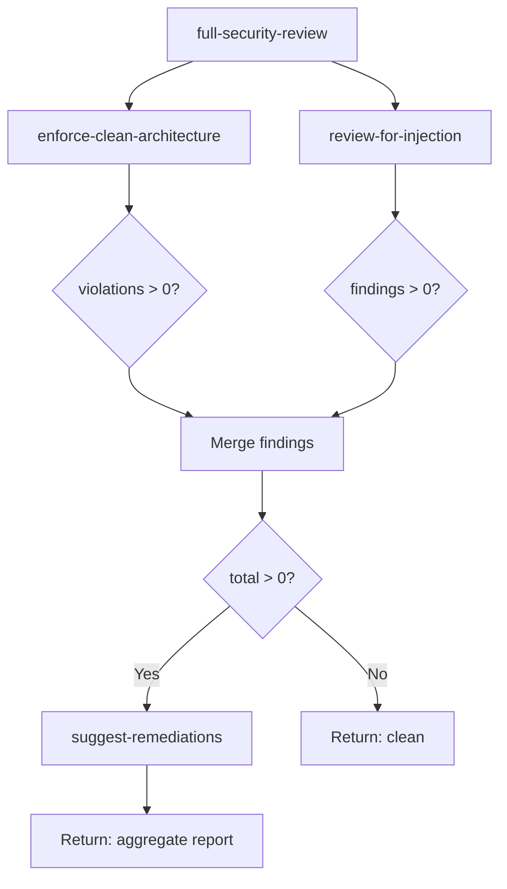

# Lab 2: Skill Composition

## Objective
Compose 3 skills into a chained workflow (detect → analyze → remediate) with conditional execution, intermediate data flow, and structured aggregate output.

## Prerequisites
- Completed Lab 1 (enforce-clean-architecture skill exists)
- Understanding of skill chaining and data flow

## Tasks

### Task 1: Author 2 additional skills

**Skill 2: `review-for-injection`**
Create `skills/review-for-injection/SKILL.md`:
- Scans Python files for SQL injection, command injection, XSS patterns
- Parameters: `target_path`, `severity_threshold`
- Output: findings array with file, line, pattern, severity
- Dependencies: `parse-imports@^1.0.0` (shared dependency)

**Skill 3: `suggest-remediations`**
Create `skills/suggest-remediations/SKILL.md`:
- Accepts findings from upstream skills
- Generates specific code-level remediation suggestions
- Parameters: `findings` (array), `remediation_style` ("inline" | "refactor")
- Output: remediations array with original finding + suggested fix
- Dependencies: none

**Acceptance:** Both skills have complete SKILL.md with frontmatter, procedure, output schema.

### Task 2: Define the composite skill
Create `skills/full-security-review/SKILL.md`:

```yaml
---
name: full-security-review
description: Chains vulnerability detection, analysis, and remediation
version: 1.0.0
parameters:
  - name: target_path
    type: string
    required: true
chain:
  - skill: enforce-clean-architecture
    input:
      target_path: "{{target_path}}"
    output_as: arch_violations
  - skill: review-for-injection
    input:
      target_path: "{{target_path}}"
    output_as: injection_findings
  - skill: suggest-remediations
    input:
      findings: "{{arch_violations.violations + injection_findings.findings}}"
    output_as: remediations
    condition: "{{(arch_violations.summary.violations + injection_findings.summary.findings) > 0}}"
---
```

**Acceptance:**
- Chain has 3 steps with explicit data flow
- Steps 1 and 2 run independently (no dependency between them)
- Step 3 is conditional (only runs if findings exist)
- Aggregate output combines all results

### Task 3: Create a codebase with multiple issue types
Extend the sample codebase from Lab 1 with injection vulnerabilities:

```python
# src/api/search.py — SQL injection
def search_users(query: str) -> list:
    sql = f"SELECT * FROM users WHERE name LIKE '%{query}%'"
    return execute_raw(sql)

# src/api/admin.py — Command injection
import subprocess
def run_report(report_name: str) -> str:
    result = subprocess.run(f"generate-report {report_name}", shell=True, capture_output=True)
    return result.stdout.decode()
```

**Acceptance:** Codebase has both architecture violations AND injection vulnerabilities.

### Task 4: Execute the composite skill
Invoke the full-security-review chain and verify:

1. Step 1 (`enforce-clean-architecture`) → detects architecture violations
2. Step 2 (`review-for-injection`) → detects SQL injection + command injection
3. Step 3 (`suggest-remediations`) → proposes fixes for all findings

**Acceptance:**
- All 3 steps execute in order
- Steps 1 and 2 produce independent outputs
- Step 3 receives merged findings from both upstream skills
- Final output is a structured aggregate

### Task 5: Test conditional execution (no findings)
Run the chain against a clean codebase (no violations, no injections).

**Acceptance:**
- Steps 1 and 2 execute and return empty findings
- Step 3 is SKIPPED (condition evaluated to false)
- Output indicates chain completed with 2/3 steps executed

### Task 6: Document composition with Mermaid



**Acceptance:** Diagram committed to `docs/skill-chain-flow.mmd`.

## Evidence to Commit
- [ ] `skills/review-for-injection/SKILL.md`
- [ ] `skills/suggest-remediations/SKILL.md`
- [ ] `skills/full-security-review/SKILL.md`
- [ ] `evidence/lab2-chain-output.json` — Full chain execution output
- [ ] `evidence/lab2-conditional-skip.json` — Clean codebase (step 3 skipped)
- [ ] `docs/skill-chain-flow.mmd` — Composition diagram
