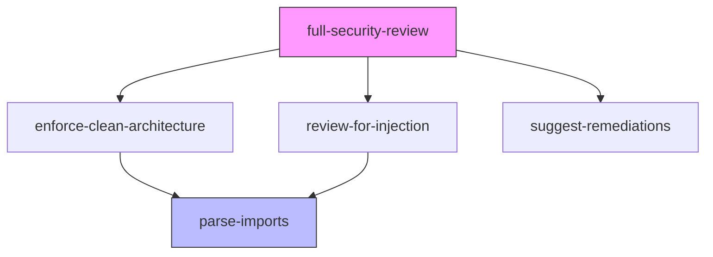

# Lab 3: Skill Versioning & Dependency Graph

## Objective
Implement semantic versioning for all skills, build a dependency graph, validate it has no cycles, and simulate a breaking change with migration.

## Prerequisites
- Completed Labs 1 and 2 (3+ skills authored)
- Python for running validation scripts

## Tasks

### Task 1: Add versioning to all skills
Ensure every skill has in its YAML frontmatter:
- `version`: semver string (e.g., `1.0.0`)
- `dependencies`: list with version constraints (e.g., `parse-imports@^1.0.0`)

Create `CHANGELOG.md` for each skill:
```markdown
# Changelog — enforce-clean-architecture

## [1.0.0] - 2026-03-01
### Initial release
- Layer-based dependency validation
- Configurable architecture rules
- JSON output schema
```

**Acceptance:** All skills have version + CHANGELOG. Dependencies use semver constraints.

### Task 2: Build and validate the dependency graph
Create `scripts/validate_skill_graph.py` (see module README for reference implementation).

Run it:
```bash
python scripts/validate_skill_graph.py skills/
```

Expected output:
```
Skills found: 4
  enforce-clean-architecture → [parse-imports]
  full-security-review → [enforce-clean-architecture, review-for-injection, suggest-remediations]
  review-for-injection → [parse-imports]
  suggest-remediations → [(none)]

OK: No circular dependencies.
```

**Acceptance:** Script runs. Zero cycles. Graph matches expected structure.

### Task 3: Generate a Mermaid dependency graph

```bash
# Auto-generate Mermaid from the Python script output
python scripts/generate_skill_graph_mermaid.py skills/ > docs/skill-dependency-graph.mmd
```

Or manually:


**Acceptance:** Mermaid diagram committed and renders correctly.

### Task 4: Simulate a breaking change
Scenario: `parse-imports` v2.0.0 changes its output schema (renames `imports` field to `import_statements`).

1. Create `parse-imports@2.0.0` with the new schema
2. Both `enforce-clean-architecture` and `review-for-injection` depend on `^1.0.0`
3. Demonstrate that version constraint prevents auto-upgrade
4. Write migration guide:
   ```markdown
   # Migration: parse-imports 1.x → 2.x

   ## Breaking Changes
   - Output field `imports` renamed to `import_statements`

   ## Migration Steps
   1. Update skill code to read `import_statements` instead of `imports`
   2. Update version constraint to `^2.0.0`
   3. Run skill tests to verify
   4. Bump consuming skill's MINOR version (new behavior, not breaking their API)
   ```

**Acceptance:**
- Breaking change documented in CHANGELOG
- Version constraint prevents accidental upgrade
- Migration guide exists with specific steps
- Consuming skills updated and re-versioned

### Task 5: Introduce a cycle (then fix it)
Temporarily add a dependency from `parse-imports` → `enforce-clean-architecture`:
```yaml
# In parse-imports SKILL.md
dependencies:
  - enforce-clean-architecture@^1.0.0  # Creates a cycle!
```

Run the validator:
```bash
python scripts/validate_skill_graph.py skills/
# Expected: ERROR: 1 cycle(s) detected!
#   parse-imports → enforce-clean-architecture → parse-imports
```

Then fix by removing the circular dependency.

**Acceptance:**
- Validator detects the cycle with clear error message
- After fix, validator reports zero cycles
- Evidence shows both states (cycle detected → cycle resolved)

## Evidence to Commit
- [ ] Updated `SKILL.md` files with semver versions
- [ ] `CHANGELOG.md` for each skill
- [ ] `scripts/validate_skill_graph.py` — DAG validator
- [ ] `docs/skill-dependency-graph.mmd` — Mermaid dependency graph
- [ ] `evidence/lab3-graph-valid.txt` — Validator output (no cycles)
- [ ] `evidence/lab3-cycle-detected.txt` — Validator output (cycle found)
- [ ] `evidence/lab3-migration-guide.md` — Breaking change migration
- [ ] `evidence/lab3-version-summary.md` — All skills with current versions
