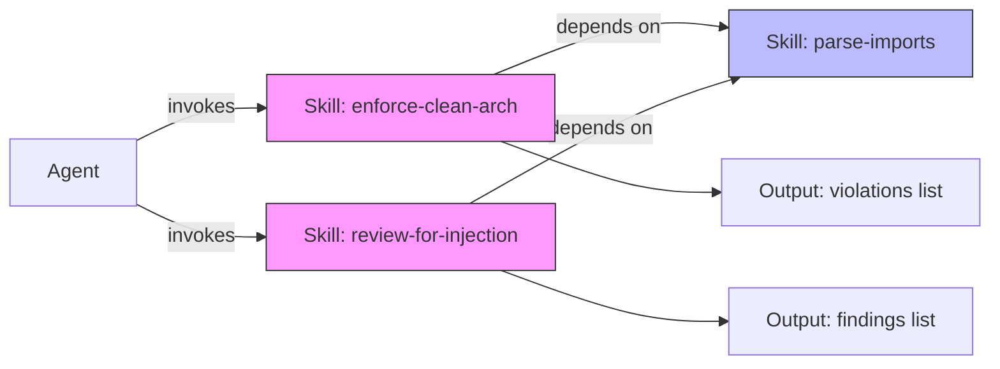
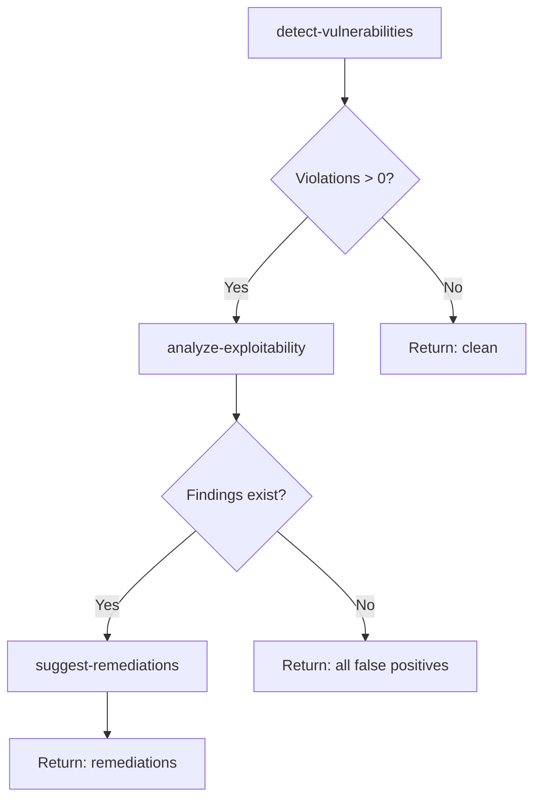

# Week 3: Skills — Deep Dive

---

## Mental Model

A **skill** is a reusable, parameterized instruction set that an agent can invoke by name. Think of skills as **functions for AI behavior** — they accept inputs, follow a defined procedure, and produce structured outputs.



**Key principle:** Skills are **stateless** and **idempotent**. Given the same input, a skill produces the same output regardless of how many times it runs. Skills compose — complex behaviors emerge from chaining simple skills.

### When NOT to Use
- ❌ One-off tasks that won't be repeated
- ❌ Tasks requiring persistent state across invocations
- ❌ Simple prompts that don't benefit from parameterization
- ❌ When the task changes significantly each time (low reuse value)

---

## Implementation Patterns

### Pattern 1: Skill Definition (`SKILL.md`)

```markdown
---
name: enforce-clean-architecture
description: Validates that source code respects clean architecture dependency rules
version: 1.2.0
parameters:
  - name: target_path
    type: string
    required: true
    description: Path to the source directory to analyze
  - name: architecture_config
    type: string
    required: false
    default: ".architecture.yaml"
    description: Path to architecture rules configuration
  - name: strict_mode
    type: boolean
    required: false
    default: false
    description: If true, treats warnings as errors
dependencies:
  - parse-imports@^1.0.0
tags:
  - architecture
  - validation
  - governance
---

# Skill: Enforce Clean Architecture

## Purpose
Validate that import statements and module dependencies respect defined architectural layers and boundaries.

## Procedure
1. Load architecture rules from `{{architecture_config}}`
2. Invoke dependency skill `parse-imports` on `{{target_path}}`
3. For each import found:
   a. Determine source layer (e.g., `domain`, `application`, `infrastructure`, `presentation`)
   b. Determine target layer of imported module
   c. Check if this dependency direction is allowed per rules
4. Collect violations
5. If `{{strict_mode}}` is true, treat warnings as errors
6. Return structured results

## Architecture Rules Format
```yaml
# .architecture.yaml
layers:
  - name: domain
    path: "src/domain/**"
    allowed_imports: []  # domain depends on nothing
  - name: application
    path: "src/application/**"
    allowed_imports: ["domain"]
  - name: infrastructure
    path: "src/infrastructure/**"
    allowed_imports: ["domain", "application"]
  - name: presentation
    path: "src/presentation/**"
    allowed_imports: ["application"]
    forbidden_imports: ["infrastructure"]  # must go through application layer
```

## Output Schema
```json
{
  "skill": "enforce-clean-architecture",
  "version": "1.2.0",
  "target": "{{target_path}}",
  "timestamp": "ISO-8601",
  "summary": {
    "files_scanned": 0,
    "violations": 0,
    "warnings": 0
  },
  "violations": [
    {
      "file": "src/presentation/api.py",
      "line": 5,
      "import": "src.infrastructure.db",
      "source_layer": "presentation",
      "target_layer": "infrastructure",
      "rule": "presentation cannot import infrastructure directly",
      "severity": "ERROR"
    }
  ]
}
```

## Failure Modes
- Architecture config not found → return error with guidance
- Circular dependency detected → return warning (not a layer violation per se)
- Unknown module (external) → skip with INFO log

## Test Cases
1. **Clean codebase**: Zero violations → PASS
2. **Single violation**: presentation→infrastructure → 1 ERROR
3. **Transitive violation**: domain→infrastructure via re-export → 1 ERROR
4. **External imports**: `import requests` → skipped (not internal)
5. **Strict mode**: warning becomes error → exit code 1
```

### Pattern 2: Skill Composition (Chaining)

```markdown
---
name: full-security-review
description: Chains detection, analysis, and remediation skills into a complete review
version: 1.0.0
parameters:
  - name: target_path
    type: string
    required: true
chain:
  - skill: detect-vulnerabilities
    input:
      target_path: "{{target_path}}"
    output_as: detections
  - skill: analyze-exploitability
    input:
      findings: "{{detections.violations}}"
    output_as: analysis
    condition: "{{detections.summary.violations > 0}}"
  - skill: suggest-remediations
    input:
      analyzed_findings: "{{analysis.findings}}"
      severity_threshold: "MEDIUM"
    output_as: remediations
    condition: "{{analysis.findings | length > 0}}"
---

# Skill: Full Security Review (Composite)

## Chain Execution


## Intermediate Data Flow
- Step 1 output feeds Step 2 input (`detections.violations`)
- Step 2 output feeds Step 3 input (`analysis.findings`)
- Conditional execution: Steps 2/3 skip if no actionable findings
- Each step logs its own correlation ID for traceability

## Error Handling
- If any step fails, chain halts and returns partial results
- Partial results include which steps completed and which failed
- No rollback needed (skills are read-only and stateless)
```

### Pattern 3: Dependency Graph Validation

```python
# scripts/validate_skill_graph.py
"""Validate skill dependency graph has no cycles."""

import yaml
import sys
from pathlib import Path
from collections import defaultdict


def load_skills(skills_dir: str) -> dict[str, list[str]]:
    """Load all SKILL.md files and extract dependency edges."""
    graph: dict[str, list[str]] = defaultdict(list)

    for skill_file in Path(skills_dir).rglob("SKILL.md"):
        content = skill_file.read_text()
        # Extract YAML frontmatter
        if content.startswith("---"):
            yaml_end = content.index("---", 3)
            metadata = yaml.safe_load(content[3:yaml_end])
            name = metadata.get("name", skill_file.parent.name)
            deps = metadata.get("dependencies", [])
            for dep in deps:
                # Strip version constraint: "parse-imports@^1.0.0" → "parse-imports"
                dep_name = dep.split("@")[0]
                graph[name].append(dep_name)
            if not deps:
                graph[name] = []

    return dict(graph)


def detect_cycles(graph: dict[str, list[str]]) -> list[list[str]]:
    """Detect cycles using DFS."""
    visited: set[str] = set()
    rec_stack: set[str] = set()
    cycles: list[list[str]] = []
    path: list[str] = []

    def dfs(node: str) -> bool:
        visited.add(node)
        rec_stack.add(node)
        path.append(node)

        for neighbor in graph.get(node, []):
            if neighbor not in visited:
                if dfs(neighbor):
                    return True
            elif neighbor in rec_stack:
                cycle_start = path.index(neighbor)
                cycles.append(path[cycle_start:] + [neighbor])
                return True

        path.pop()
        rec_stack.discard(node)
        return False

    for node in graph:
        if node not in visited:
            dfs(node)

    return cycles


if __name__ == "__main__":
    skills_dir = sys.argv[1] if len(sys.argv) > 1 else "skills/"
    graph = load_skills(skills_dir)

    print(f"Skills found: {len(graph)}")
    for name, deps in sorted(graph.items()):
        dep_str = ", ".join(deps) if deps else "(none)"
        print(f"  {name} → [{dep_str}]")

    cycles = detect_cycles(graph)
    if cycles:
        print(f"\nERROR: {len(cycles)} cycle(s) detected!")
        for cycle in cycles:
            print(f"  {'→'.join(cycle)}")
        sys.exit(1)
    else:
        print("\nOK: No circular dependencies.")
        sys.exit(0)
```

### Pattern 4: Semantic Versioning for Skills

```yaml
# skills/enforce-clean-architecture/CHANGELOG.md
# Changelog

## [1.2.0] - 2026-03-01
### Added
- `strict_mode` parameter to treat warnings as errors
- Support for `forbidden_imports` in architecture config

## [1.1.0] - 2026-02-15
### Added
- External import detection (skip with INFO)
### Changed
- Output schema: added `warnings` count to summary

## [1.0.0] - 2026-02-01
### Initial release
- Layer-based dependency validation
- Configurable architecture rules via YAML
- JSON output schema
```

**Versioning rules:**
- **MAJOR** (2.0.0): Output schema changes, parameter removal, behavioral change
- **MINOR** (1.1.0): New optional parameter, new output fields (additive), new features
- **PATCH** (1.0.1): Bug fix, documentation update, no behavioral change

---

## Governance & Security Controls

| Control | Implementation |
|---------|---------------|
| **Parameterization** | All inputs validated against declared type/constraints before execution |
| **Scope limitation** | Skills declare which tools they use; agent enforces this |
| **Data boundaries** | Skills cannot access data outside their declared `target_path` |
| **Audit hooks** | Each skill invocation logged with correlation ID and input hash |
| **Version pinning** | Dependencies use semver constraints (`^1.0.0`, `~1.2.0`) |
| **Breaking change detection** | Output schema diff on version bump; consumers alerted |

---

## Observability

### What to Log
- Skill invocation (name, version, parameters, caller agent)
- Dependency resolution (which versions resolved)
- Execution duration per skill
- Output summary (not full output — just counts/metrics)
- Chain progression (which step, conditionals evaluated)

### Correlation IDs
```
agent-session: agt-{uuid}
└── skill-chain: skl-{uuid}
    ├── skill-invoke: skl-{uuid}-001 (detect-vulnerabilities@1.3.0)
    │   └── dep-invoke: skl-{uuid}-001-dep-001 (parse-imports@1.0.2)
    ├── skill-invoke: skl-{uuid}-002 (analyze-exploitability@2.1.0)
    └── skill-invoke: skl-{uuid}-003 (suggest-remediations@1.0.0)
```

---

## Test Strategy

| Test Type | What to Validate |
|-----------|-----------------|
| **Unit** | Each skill with known inputs produces expected output |
| **Property-based** | Random valid inputs always produce valid output schema |
| **Adversarial** | Malformed inputs rejected gracefully (no crash, clear error) |
| **Composition** | Chain produces correct aggregate output |
| **Cycle detection** | DAG validator catches any circular dependency |
| **Version compat** | Consumers work when dependency bumps minor/patch version |
| **Idempotency** | Running skill twice on same input → same output |

---

## Performance Considerations

- **Chain overhead**: Each skill invocation adds latency. Minimize chain depth (≤5 skills).
- **Fanout**: Parallel skill execution possible when skills have no data dependency.
- **Caching**: Identical invocations can be cached by input hash (skills are stateless).
- **Large codebases**: Skills scanning `target_path` should use streaming file reads, not full load.

## Failure Modes

| Failure | Detection | Recovery |
|---------|-----------|----------|
| Missing dependency | Skill resolution fails | Log error, return partial chain results |
| Version conflict | Two skills need incompatible versions of same dep | Pin to compatible range or fork |
| Schema mismatch | Output doesn't match declared schema | Validate output; reject + log |
| Infinite chain | Skill A chains to B chains to A | DAG validator (pre-execution check) |

---

## Rollout Playbook

1. **Catalog existing patterns**: Identify recurring prompts/reviews in your team. Each is a skill candidate.
2. **Start with 3 skills**: One detection, one analysis, one remediation. Build the chain.
3. **Validate composition**: Run DAG validator on every skill addition.
4. **Version from day 1**: Tag every skill with semver. Maintain CHANGELOG.
5. **Skill library**: Publish to shared repo. Index with metadata for discoverability.
6. **Governance**: PR review required for skill changes. Breaking changes need migration plan.
