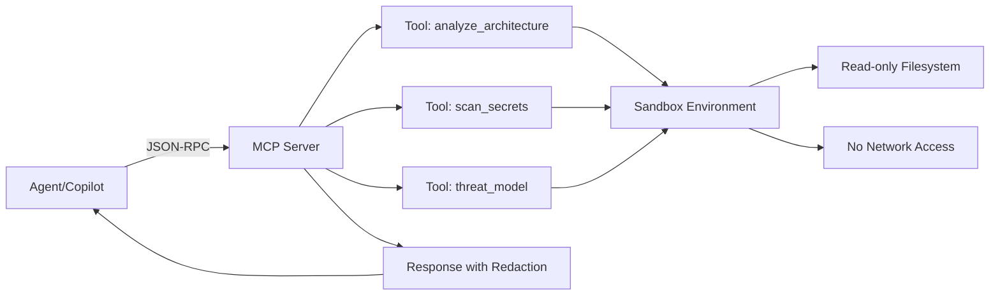

# Week 4: MCP Server — Deep Dive

---

## Mental Model

An **MCP (Model Context Protocol) server** is a standalone service that exposes custom tools and capabilities to AI agents. Think of it as a **plugin architecture for AI** — agents discover and invoke tools via a standardized protocol.



**Key principle:** MCP servers enforce **sandboxed execution** with explicit resource boundaries. Every tool has defined inputs, outputs, error contracts, and timeouts.

### When NOT to Use
- ❌ Simple one-off scripts (use Copilot CLI directly)
- ❌ Tasks that fit within existing agent capabilities
- ❌ When network latency to server is unacceptable
- ❌ Stateful operations requiring session management (MCP tools are stateless)

---

## Implementation Patterns

### Pattern 1: Basic MCP Server (Python)

```python
# mcp_server.py — Minimal MCP server with Python SDK
import asyncio
import json
from mcp.server import Server
from mcp.server.stdio import stdio_server
from mcp.types import Tool, TextContent

# Initialize server
server = Server("security-tools")

@server.list_tools()
async def list_tools() -> list[Tool]:
    """Register available tools."""
    return [
        Tool(
            name="scan_secrets",
            description="Scan source code for hardcoded secrets and credentials",
            inputSchema={
                "type": "object",
                "properties": {
                    "target_path": {
                        "type": "string",
                        "description": "Path to scan (relative to workspace root)"
                    },
                    "patterns": {
                        "type": "array",
                        "items": {"type": "string"},
                        "description": "Custom regex patterns to match (optional)",
                        "default": []
                    }
                },
                "required": ["target_path"]
            }
        ),
        Tool(
            name="threat_model",
            description="Generate STRIDE threat model for specified components",
            inputSchema={
                "type": "object",
                "properties": {
                    "component": {
                        "type": "string",
                        "description": "Component name (e.g., 'authentication', 'payment-api')"
                    },
                    "entry_points": {
                        "type": "array",
                        "items": {"type": "string"},
                        "description": "List of entry point methods/endpoints"
                    }
                },
                "required": ["component", "entry_points"]
            }
        )
    ]

@server.call_tool()
async def call_tool(name: str, arguments: dict) -> list[TextContent]:
    """Execute tool and return results."""
    if name == "scan_secrets":
        return await scan_secrets_impl(arguments)
    elif name == "threat_model":
        return await threat_model_impl(arguments)
    else:
        raise ValueError(f"Unknown tool: {name}")

async def scan_secrets_impl(args: dict) -> list[TextContent]:
    """Scan for hardcoded secrets."""
    import re
    from pathlib import Path
    
    target = Path(args["target_path"])
    default_patterns = [
        r'(?i)(api[_-]?key|secret|password|token)\s*=\s*["\'][^"\']{8,}["\']',
        r'ghp_[A-Za-z0-9]{36}',  # GitHub PAT
        r'sk-[A-Za-z0-9]{48}',   # OpenAI API key
    ]
    patterns = args.get("patterns", []) + default_patterns
    
    findings = []
    for file in target.rglob("*.py"):
        content = file.read_text(errors="ignore")
        for i, line in enumerate(content.splitlines(), 1):
            for pattern in patterns:
                if re.search(pattern, line):
                    findings.append({
                        "file": str(file),
                        "line": i,
                        "pattern": pattern,
                        "severity": "CRITICAL"
                    })
    
    result = {
        "tool": "scan_secrets",
        "target": str(target),
        "findings": findings,
        "summary": {"total": len(findings)}
    }
    
    return [TextContent(type="text", text=json.dumps(result, indent=2))]

async def threat_model_impl(args: dict) -> list[TextContent]:
    """Generate STRIDE threat model."""
    component = args["component"]
    entry_points = args["entry_points"]
    
    stride_threats = {
        "Spoofing": f"Can attacker impersonate a legitimate user of {component}?",
        "Tampering": f"Can attacker modify data in transit or at rest for {component}?",
        "Repudiation": f"Can actions on {component} be performed without audit trail?",
        "Information Disclosure": f"Can attacker access sensitive data via {component}?",
        "Denial of Service": f"Can attacker make {component} unavailable?",
        "Elevation of Privilege": f"Can attacker gain unauthorized permissions via {component}?"
    }
    
    threats = []
    for category, question in stride_threats.items():
        threats.append({
            "category": category,
            "question": question,
            "entry_points": entry_points,
            "mitigation_required": True
        })
    
    result = {
        "tool": "threat_model",
        "component": component,
        "model": "STRIDE",
        "threats": threats
    }
    
    return [TextContent(type="text", text=json.dumps(result, indent=2))]

async def main():
    """Run MCP server on stdio."""
    async with stdio_server() as (read_stream, write_stream):
        await server.run(
            read_stream,
            write_stream,
            server.create_initialization_options()
        )

if __name__ == "__main__":
    asyncio.run(main())
```

### Pattern 2: Sandboxing with Resource Limits

```python
# mcp_server_sandboxed.py — MCP server with execution sandbox
import subprocess
import tempfile
import shutil
from pathlib import Path

class SandboxedTool:
    """Execute tools in restricted subprocess."""
    
    def __init__(self, workspace_root: Path, timeout: int = 30):
        self.workspace_root = workspace_root.resolve()
        self.timeout = timeout
    
    async def execute_sandboxed(self, tool_fn, args: dict) -> dict:
        """Run tool with filesystem and network restrictions."""
        # Validate path doesn't escape workspace
        target_path = self.workspace_root / args.get("target_path", "")
        if not self._is_safe_path(target_path):
            raise ValueError(f"Path {target_path} outside workspace")
        
        # Create read-only view (Linux)
        with tempfile.TemporaryDirectory() as tmpdir:
            tmp_workspace = Path(tmpdir) / "workspace"
            shutil.copytree(self.workspace_root, tmp_workspace, symlinks=False)
            
            # Make read-only
            for item in tmp_workspace.rglob("*"):
                item.chmod(0o444 if item.is_file() else 0o555)
            
            # Execute with timeout
            try:
                result = await asyncio.wait_for(
                    tool_fn({**args, "target_path": tmp_workspace / args["target_path"]}),
                    timeout=self.timeout
                )
                return result
            except asyncio.TimeoutError:
                raise TimeoutError(f"Tool execution exceeded {self.timeout}s timeout")
    
    def _is_safe_path(self, path: Path) -> bool:
        """Ensure path doesn't escape workspace via symlinks or ../ traversal."""
        try:
            path.resolve().relative_to(self.workspace_root)
            return True
        except ValueError:
            return False
```

### Pattern 3: Streaming Responses

```python
# streaming_tool.py — Tool with progress streaming
from mcp.types import TextContent, ImageContent, EmbeddedResource

async def scan_large_codebase_streaming(args: dict):
    """Stream results as files are scanned (not all at once)."""
    target = Path(args["target_path"])
    total_files = sum(1 for _ in target.rglob("*.py"))
    
    processed = 0
    findings = []
    
    for file in target.rglob("*.py"):
        # Process file
        file_findings = await scan_file_for_secrets(file)
        findings.extend(file_findings)
        
        processed += 1
        
        # Stream progress update every 10 files
        if processed % 10 == 0:
            progress = {
                "type": "progress",
                "processed": processed,
                "total": total_files,
                "findings_so_far": len(findings)
            }
            yield TextContent(type="text", text=json.dumps(progress))
    
    # Final result
    yield TextContent(type="text", text=json.dumps({
        "type": "final",
        "total_files": total_files,
        "findings": findings
    }))
```

### Pattern 4: Error Contracts

```python
# error_handling.py — Explicit error types and retry guidance
from enum import Enum

class ToolErrorCode(Enum):
    INVALID_INPUT = "INVALID_INPUT"
    PATH_NOT_FOUND = "PATH_NOT_FOUND"
    PERMISSION_DENIED = "PERMISSION_DENIED"
    TIMEOUT = "TIMEOUT"
    INTERNAL_ERROR = "INTERNAL_ERROR"

class ToolError(Exception):
    """Structured error for MCP tools."""
    
    def __init__(self, code: ToolErrorCode, message: str, retryable: bool = False):
        self.code = code
        self.message = message
        self.retryable = retryable
        super().__init__(f"[{code.value}] {message}")
    
    def to_json(self) -> dict:
        return {
            "error": {
                "code": self.code.value,
                "message": self.message,
                "retryable": self.retryable
            }
        }

# In tool implementation
async def scan_secrets_with_errors(args: dict) -> list[TextContent]:
    target = Path(args.get("target_path", ""))
    
    if not target:
        raise ToolError(
            ToolErrorCode.INVALID_INPUT,
            "target_path is required",
            retryable=False
        )
    
    if not target.exists():
        raise ToolError(
            ToolErrorCode.PATH_NOT_FOUND,
            f"Path not found: {target}",
            retryable=False
        )
    
    if not target.is_dir():
        raise ToolError(
            ToolErrorCode.INVALID_INPUT,
            "target_path must be a directory",
            retryable=False
        )
    
    try:
        return await scan_secrets_impl(args)
    except asyncio.TimeoutError:
        raise ToolError(
            ToolErrorCode.TIMEOUT,
            f"Scan exceeded {self.timeout}s timeout",
            retryable=True
        )
    except Exception as e:
        raise ToolError(
            ToolErrorCode.INTERNAL_ERROR,
            f"Unexpected error: {str(e)}",
            retryable=True
        )
```

---

## Governance & Security Controls

| Control | Implementation |
|---------|---------------|
| **Sandboxing** | Read-only filesystem, no network egress, subprocess isolation |
| **Timeout enforcement** | Every tool has max execution time (default 30s) |
| **Path validation** | Prevent `../` traversal and symlink escape |
| **Redaction** | Strip secrets/PII from responses before returning to agent |
| **RBAC** | Tools declare required permissions; server enforces |
| **Audit logging** | All tool invocations logged with correlation ID |

---

## Observability

### What to Log
- Tool invocation (name, arguments hash, correlation ID)
- Execution duration
- Resource usage (CPU, memory, file I/O)
- Error type and retryability
- Redacted response summary (not full content)

### Correlation IDs
```
agent-session: agt-{uuid}
└── mcp-call: mcp-{uuid}
    ├── tool-invoke: mcp-{uuid}-001 (scan_secrets)
    │   └── duration: 2.3s, files: 42, findings: 3
    └── tool-invoke: mcp-{uuid}-002 (threat_model)
        └── duration: 0.5s, threats: 6
```

### Redaction Filter
```python
def redact_response(data: dict) -> dict:
    """Remove secrets before returning to agent."""
    import re
    
    redacted = json.dumps(data)
    
    # Redact common secret patterns
    redacted = re.sub(r'ghp_[A-Za-z0-9]{36}', '[REDACTED_TOKEN]', redacted)
    redacted = re.sub(r'sk-[A-Za-z0-9]{48}', '[REDACTED_KEY]', redacted)
    redacted = re.sub(r'"password":\s*"[^"]*"', '"password": "[REDACTED]"', redacted)
    
    return json.loads(redacted)
```

---

## Test Strategy

| Test Type | What to Validate |
|-----------|-----------------|
| **Unit** | Each tool with known inputs produces expected output |
| **Sandbox escape** | Path traversal (`../../etc/passwd`) is blocked |
| **Timeout** | Tool exceeding timeout is killed and returns partial results |
| **Error contracts** | All error codes are reachable and structurally correct |
| **Streaming** | Partial results emitted before final result |
| **Redaction** | Secrets in tool output are stripped before agent receives it |
| **Idempotency** | Same input → same output (no side effects) |

---

## Performance Considerations

- **Cold start**: MCP server startup time affects first tool call. Keep dependencies minimal.
- **Concurrency**: Tools should be async to allow concurrent execution.
- **Large responses**: Stream results for scans of >100 files to avoid memory bloat.
- **Caching**: Repeated calls with same args can be cached (tools are stateless).

## Failure Modes

| Failure | Detection | Recovery |
|---------|-----------|----------|
| Tool crashes | Server logs exception | Return error with INTERNAL_ERROR code |
| Timeout | asyncio.TimeoutError | Kill subprocess, return partial results |
| Invalid input | Schema validation fails | Return INVALID_INPUT error |
| Sandbox escape attempt | Path validation fails | Deny with PERMISSION_DENIED |
| Server unresponsive | Agent timeout (30s+) | Agent retries with backoff |

---

## Rollout Playbook

1. **Start with read-only tools**: Building trust. No write/delete operations.
2. **Deploy server locally first**: Test on developer machines before centralized deployment.
3. **Add 1-2 tools at a time**: Validate each tool's error handling and performance.
4. **Monitor tool usage**: Which tools are called most? Are timeouts frequent?
5. **Iterate on sandbox**: If tools need more access, expand sandbox incrementally.
6. **Publish tool catalog**: Document all tools with examples in shared repo.
